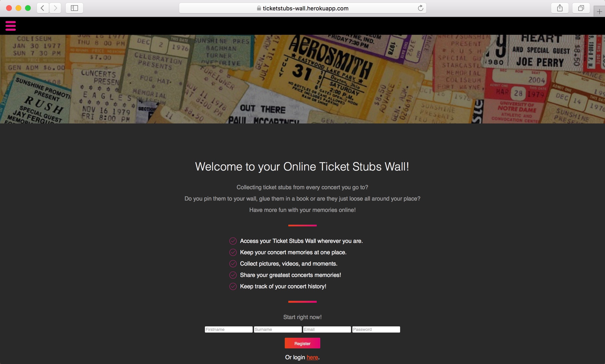
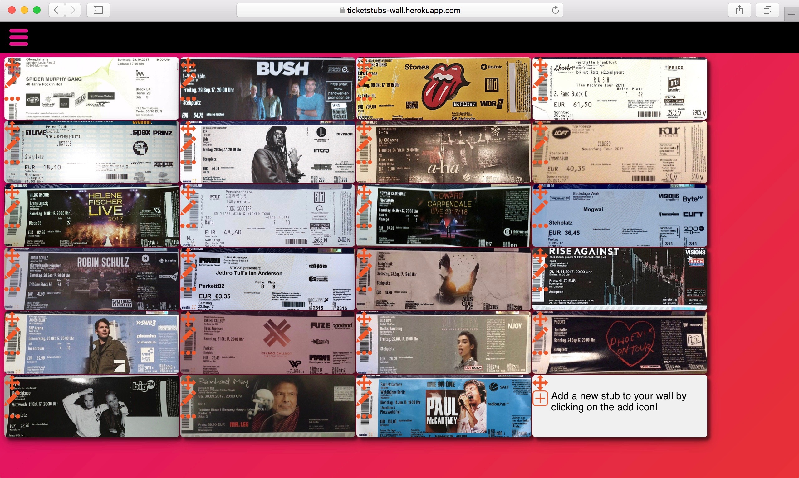

# ticketstubs-wall

## Overview
This project was firstly released within the final week at SPICED Academy and is targeted to users who like to collect their concerts or sports tickets.
Users can upload pictures of their collected event tickets and view them on a pinwall-like page.
Hosted on [Heroku](https://ticketstubs-wall.herokuapp.com/)

## Technologies
- React.js
- Node.js
- Express.js
- PostgreSQL
- AWS S3

## Details

### Login & Registration

Users can register or login when already registered.

### Wall
When firstly viewing the wall, users see an empty example ticket. With a click on the add icon or via the hamburger menu, users can upload their own tickets and adding event details (name, venue, date, time). The uploaded image will be displayed immediately.
Uploaded tickets have an option to edit event details or delete tickets.
Each ticket can be dragged around on the wall.

### Planned Features
- rotate tickets
- save ticket positions
- cut uploaded images to ticket size
- Event list
- event reports
- import online and mobile tickets
- traveling ticketing
